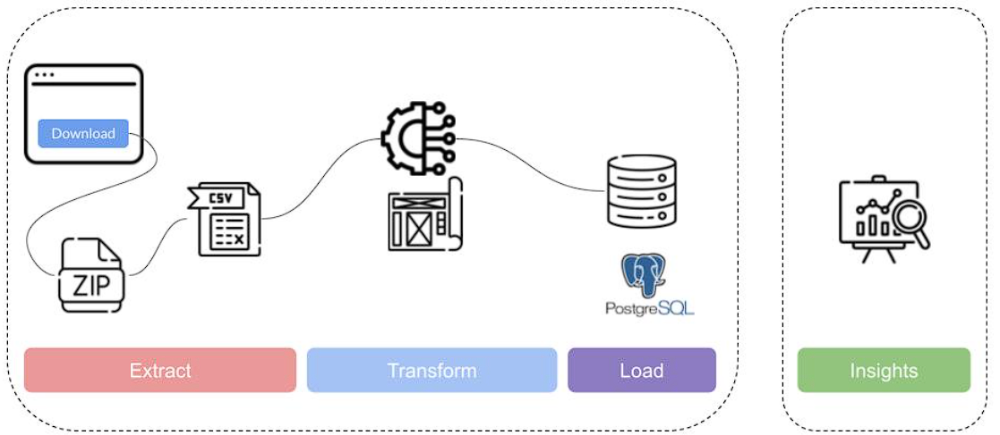

# ETL-residential-property-data
Python-based ETL pipeline for processing and managing residential property sales data in Ireland. 

This project is an Extract, Transform, Load (ETL) pipeline for processing residential property data from a public source and loading it into a PostgreSQL database. The pipeline consists of three main steps: extraction, transformation, and loading.

## Overview

The ETL process is designed to handle residential property data, applying various transformations to the raw data before loading it into a clean database table. The project uses Python and SQLAlchemy for database interactions.



### Key Features

- **Extraction:** The project sources data from a ZIP file retrieved from an external website.
  
- **Transformation:** Robust data cleaning, filtering, and restructuring processes ensure that the data is standardized and ready for analysis.

- **Loading:** Efficient insertion of transformed data into a PostgreSQL database.

- **Analysis and Reporting:** Utilization of the PostgreSQL database for data analysis, providing a foundation for informed decision-making.

- **CSV Handling:** Reading, processing, and writing of CSV files during extraction and transformation phases.

- **Exception Handling:** Robust mechanisms for handling exceptions throughout the project provide meaningful error messages for debugging and user understanding.


## Structure

```bash
residential-property-data-etl/
│   └── data/
│       ├── raw/
│       │   └── downloaded_at=<current_date>/
│       │       └── ppr-all.csv
│       └── source/
│           └── downloaded_at=<current_date>/
│               └── PPR-ALL.zip
│
├── scripts/
│   ├── common/
│   │   ├── base.py
│   │   ├── create_tables.py
│   │   └── tables.py
│   │
│   ├── execute.py
│   ├── extract.py
│   ├── load.py
│   └── transform.py
│
├── .gitignore
├── README.md
└── requirements.txt
```

## data/
- **raw/**
  - *downloaded_at=<current_date>/*
    - `ppr-all.csv`: Raw data file downloaded from the source containing property transactions.

- **source/**
  - *downloaded_at=<current_date>/*
    - `PPR-ALL.zip`: ZIP file downloaded from the external website containing property transaction data.

## scripts/
### common/
- **`base.py`**: Contains the SQLAlchemy `Base` class, the base class for all declarative class definitions in SQLAlchemy.

- **`create_tables.py`**: Script for creating database tables. Defines tables (`PprRawAll` and `PprCleanAll`) and ensures the `ppr_raw_all` table is empty with the primary key sequence restarted.

- **`tables.py`**: Defines the structure of the database tables (`PprRawAll` and `PprCleanAll`). Includes columns such as `id`, `date_of_sale`, `address`, `postal_code`, `county`, `price`, `description`, and `transaction_id`.

### execute.py
- Entry point for executing the ETL process.

### extract.py
- This script handles the extraction phase of the ETL process. It downloads a snapshot ZIP file from an external website, checks if the file already exists, and, if not, creates the necessary folders and downloads the file. In case of an error during download, it raises an exception and exits the script. After ensuring the snapshot file is available, it extracts the contents of the ZIP file, processes the CSV data, and saves the processed data to the output CSV file in the "raw" data directory. If the output CSV file already exists, it skips the process, preventing redundant data extraction.

### load.py
- The loading phase is executed by this script, handling the insertion and deletion operations in the clean table. It retrieves transaction IDs from the clean table, fetches transactions from the raw table that do not exist in the clean table, and inserts the selected columns (date_of_sale, address, postal_code, county, price, description) into the clean table. Simultaneously, it identifies transactions in the clean table without corresponding entries in the raw table and deletes those transactions from the clean table. This deletion ensures that the clean table stays synchronized with the latest snapshot, preventing outdated or irrelevant data from persisting. The script ends by closing the database session.

### transform.py
- The transformation phase is managed by this script. It applies various transformations to the data obtained from the "raw" CSV file. These transformations include updating the date format, converting strings to lowercase, and simplifying the property description. It then creates PprRawAll objects, each representing a row in the CSV file, and saves these objects to the database. Before saving, it truncates the "ppr_raw_all" table to ensure it is empty, preventing duplicate entries. If an error occurs during the transformation or data saving process, it raises an exception and exits the script.
